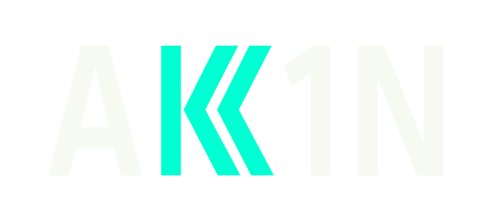

  
  # Olá, meu nome é Breno Adriano! 👋

  ### A.K.A
  

  

---

- 🎓 Estudante de **Desenvolvimento de Sistemas** (1º Semestre)
- 🐍 Focado em dominar **Python** e as bases da Web (**HTML & CSS**)
- 🚀 Preparando-se para o mercado de tecnologia através de projetos práticos
- 🌱 Atualmente explorando: Lógica de programação e Estruturas de Dados

---

### 🛠️ Tecnologias que estudo

---

### 📊 Estatísticas do GitHub

---

### 📫 Contato

